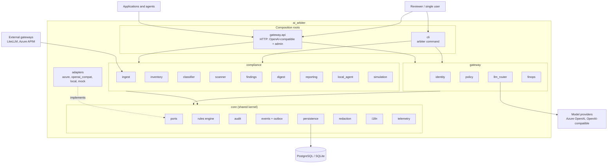
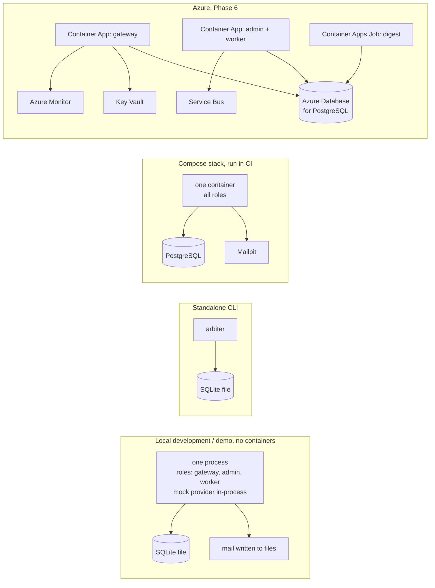

# Architecture overview

Status: **accepted** on 2026-10-02 with ADR-0010 to ADR-0023. What v0.1 implements of it,
and in which order, is set by ADR-0009. Parts already implemented are listed in the
[Phase 2 summary](../phases/phase-2-scaffolding.md).

- [Flows](flows.md) — sequence and state diagrams
- [Data model](data-model.md) — entities and relations
- [Interfaces](interfaces.md) — ports, events and the decision envelope
- [Decisions](../adr/README.md) — ADR index

## 1. The idea in one paragraph

Arbiter links two things that are usually separate: what AI systems an organisation
*says* it runs (an inventory classified under the EU AI Act) and what its traffic *shows*
it runs (LLM calls, later agent and tool calls). The gateway produces the traffic
evidence and enforces constraints derived from the classification; the compliance toolkit
turns evidence into classified systems, findings and a daily digest. Either half works
without the other: the toolkit can ingest records from another gateway, and the gateway
can run with compliance modules disabled.

## 2. Components



The arrows between `gateway`, `compliance` and `core` are the only allowed import
directions. `gateway` and `compliance` exchange information in two ways, both defined in
`core`:

- **Events.** The gateway publishes `InteractionRecorded`; compliance subscribes.
- **Ports.** The gateway asks `SystemDirectory` for a system's risk profile; the
  inventory module implements it.

### Module responsibilities

| Package | Module | Responsibility |
|---|---|---|
| core | config | Layered settings: defaults → `arbiter.yaml` → environment (`ARBITER_…`) → secret references |
| core | ports | Protocols for everything replaceable |
| core | plugins | Entry-point discovery, activation from configuration |
| core | rules | Rule pack loading, schema validation, condition evaluation, match trace |
| core | audit | Hash-chained append-only log, verification, export |
| core | events | Event envelope, in-process bus, transactional outbox |
| core | persistence | Engine and session setup, portable types, tenant-scoped repositories |
| core | redaction | Built-in PII detectors, redaction strategies |
| core | i18n | Message catalogues, locale formatting |
| core | telemetry | OpenTelemetry bootstrap; no-op without the `otel` extra |
| gateway | api | FastAPI application factory, routers, authentication dependency, error model |
| gateway | identity | Tenants, teams, projects, principals, API keys, role checks |
| gateway | policy | Fact collection and rule evaluation before and after the provider call |
| gateway | llm_router | Candidate selection, ordering strategies, fallback and retry |
| gateway | finops | Price catalogue, cost calculation, usage roll-ups, budgets |
| gateway | a2a, mcp_registry | Reserved for v0.2 |
| compliance | ingest | Telemetry sources and mapping to the canonical record |
| compliance | inventory | AI system registry, discovery from interactions, `SystemDirectory` |
| compliance | classifier | AI Act classification from declared facts |
| compliance | scanner | Detectors that produce facts and evidence; scan rules |
| compliance | findings | Finding lifecycle, review workflow, suppressions |
| compliance | digest | Daily digest model and rendering |
| compliance | reporting | System and audit reports |
| compliance | local_agent | Consented local discovery |
| compliance | simulation | Scenario fixtures and demo seeding |
| adapters | azure | Azure OpenAI auth, Key Vault, Service Bus, Monitor exporter (extra `azure`) |
| adapters | openai_compat | OpenAI-wire-format provider |
| adapters | local | Environment secret store, SMTP notifier, filesystem storage |
| adapters | mock | Scriptable provider and other test doubles |

One deviation from the brief: **audit sits in `core`**, not under `gateway`
([ADR-0023](../adr/0023-audit-log-in-shared-core.md)). The brief lists it as a gateway
module, but classification and finding decisions made by the offline CLI must be audited
too, so the log has to be available without the gateway.

## 3. Repository layout

```text
ai-arbiter/
├── pyproject.toml              # one distribution: ai-arbiter (extras: gateway, azure, pii, otel, all)
├── uv.lock
├── CHANGELOG.md
├── CLAUDE.md
├── src/ai_arbiter/
│   ├── core/
│   │   ├── config/  domain/  ports/  plugins/  rules/  audit/
│   │   ├── events/  persistence/  redaction/  i18n/  telemetry/
│   ├── gateway/
│   │   ├── api/  identity/  policy/  llm_router/  finops/
│   │   ├── a2a/                # v0.2
│   │   └── mcp_registry/       # v0.2
│   ├── compliance/
│   │   ├── ingest/  inventory/  classifier/  scanner/  findings/
│   │   ├── digest/  reporting/  local_agent/  simulation/
│   ├── adapters/
│   │   ├── azure/  openai_compat/  local/  mock/
│   ├── cli/                    # Typer application: `arbiter`, alias `ai-arbiter`
│   ├── migrations/             # Alembic, shipped inside the package for the CLI
│   ├── rulepacks/              # data: ai-act/<version>/, policy/<version>/, prices/<version>/
│   ├── locales/                # en.yaml, it.yaml
│   └── templates/              # Jinja2: digest and report, Markdown and HTML
├── tests/
│   ├── unit/  integration/  contract/  e2e/
├── deploy/
│   ├── docker/  compose/  bicep/
├── docs/
│   ├── adr/  architecture/  phases/
├── examples/
└── .github/workflows/
```

### Import rules (checked in CI)

| Rule | Reason |
|---|---|
| `core` imports nothing from `gateway`, `compliance`, `adapters`, `cli` | Shared kernel stays independent |
| `gateway` and `compliance` do not import each other | Either can be disabled or used alone |
| Only `adapters.azure` imports `azure.*` | Brief: no core dependency on Azure SDKs |
| Only `gateway.api` and `cli` import `adapters` | Composition happens at the edges |
| `fastapi` is imported only under `gateway.api` | Base install has no web framework |

## 4. Runtime topology



The same code and the same services run in all four; only configuration and active
adapters differ (ADR-0020). Local development needs no container runtime; the Compose
stack exists for those who have one and is exercised by CI (ADR-0025).

## 5. Cross-cutting design

### Decisions are first-class

Every automated outcome (a policy verdict, a route choice, a budget block, a
classification, a finding) is a `Decision` with the same envelope: what was decided, by
which rule and rule pack version, on which facts, with which legal references. The audit
log stores decisions; reports and API responses render them. This is how the brief's
"every automated decision is explainable and traced" is met in one place rather than
module by module. See [interfaces](interfaces.md).

### Request path budget

The gateway adds work before and after the provider call. The design keeps it bounded:

- Before the call: one key lookup (cached), one risk-profile lookup (cached), a budget
  read from roll-ups, PII detection, rule evaluation. No network call other than the
  provider.
- After the call: one database transaction writing the interaction, the audit entries and
  the outbox events.
- Budget checks read roll-ups, so a burst of concurrent requests can overshoot a hard
  limit slightly. This is accepted and documented.
- Added latency is measured in CI against the mock provider.

### Streaming

- Routing and pre-call policy run before the first byte is sent.
- Upstream usage is requested in the stream; if a provider does not return it, token
  counts are estimated and flagged as estimated.
- Post-call policy on a stream can detect and record, not prevent. A buffered mode that
  delays output until checks pass is a later option.
- The interaction and audit records are written when the stream ends or is aborted.

### Configuration

Twelve-factor: one settings tree, validated at startup. A value can be a secret reference
(`secret://name`) resolved through the `SecretStore` port. Provider deployments, routes,
price catalogue version and active plugins are configuration in v0.1; tenants, keys,
budgets and systems are data.

### Observability

OpenTelemetry traces, metrics and logs through the SDK, exported over OTLP. Spans carry
identifiers and counts, never content. The Azure Monitor exporter is an adapter.

## 6. Threat model (first pass)

| Asset | Threat | Mitigation in the design |
|---|---|---|
| Provider credentials | Theft from configuration or logs | Secret references only; resolved in memory through `SecretStore`; never logged |
| Arbiter API keys | Database leak exposes usable keys | Stored as hashes; shown once at creation; prefix kept for identification |
| Tenant data | Cross-tenant read through a missing filter | Tenant context mandatory in repositories; tests that query across tenants; PostgreSQL row-level security in Phase 6, inside the PostgreSQL adapter (ADR-0015) |
| Prompts and completions | Exposure through storage or telemetry | Not persisted by default (ADR-0018); spans and logs carry no content |
| Audit log | Modification by an insider | Hash chain detects partial changes; the chain head is anchored outside the database so a full rewrite is detectable; signed checkpoints in Phase 6 (ADR-0017) |
| Policy enforcement | Bypass by calling the provider directly | Out of Arbiter's control; discovery of undeclared use through external ingestion is the compensating signal |
| Rule packs | Malicious third-party pack | Rules are data with a closed operator set; no code execution (ADR-0012) |
| Plugins | Unwanted code loaded from an installed package | Activation only by name in configuration (ADR-0011) |
| Gateway availability | Budget or audit dependency failing | `audit.fail_mode` explicit; provider fallback; health endpoints separate liveness from readiness |
| Local scan | Reading or leaking sensitive local files | Read-only; paths listed before running; consent per category; secret values never captured; no network |
| Ingested telemetry | Poisoned or forged records from an external source | Source authentication on push; provenance stored per record; ingestion audited |
| Supply chain | Compromised dependency or release | Locked dependencies, dependency and secret scanning in CI, Trusted Publishing without long-lived tokens |

## 7. What this document does not settle

- API key format, hashing parameters and rotation: Phase 3.
- The exact AI Act rule set: Phase 4, after verification against the primary source.
- A2A and MCP module design: Phase 5.
- Azure resource layout, networking and identity: Phase 6.
