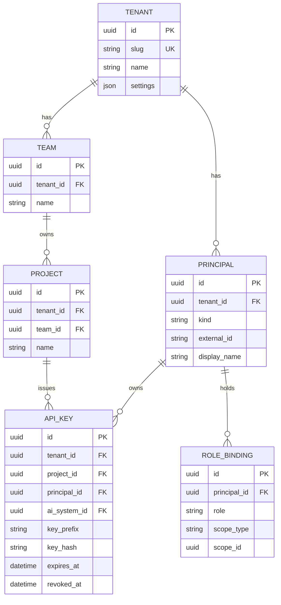
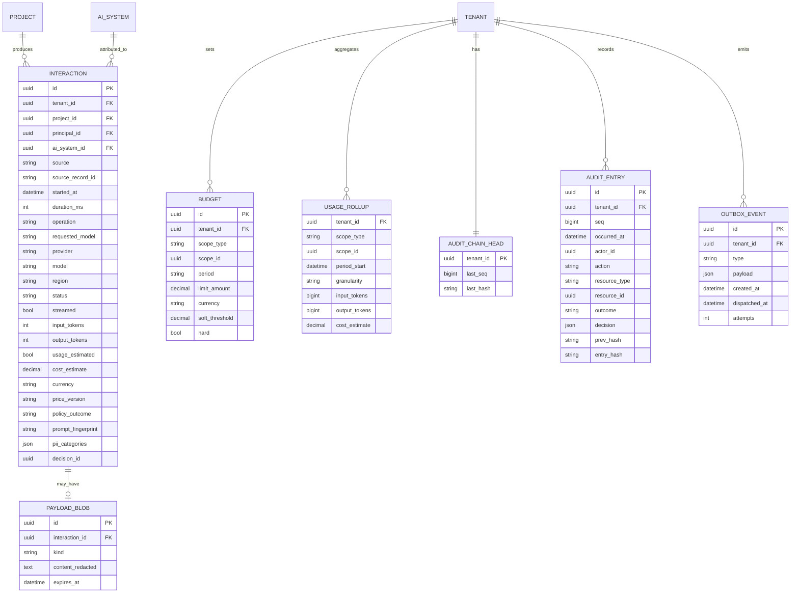
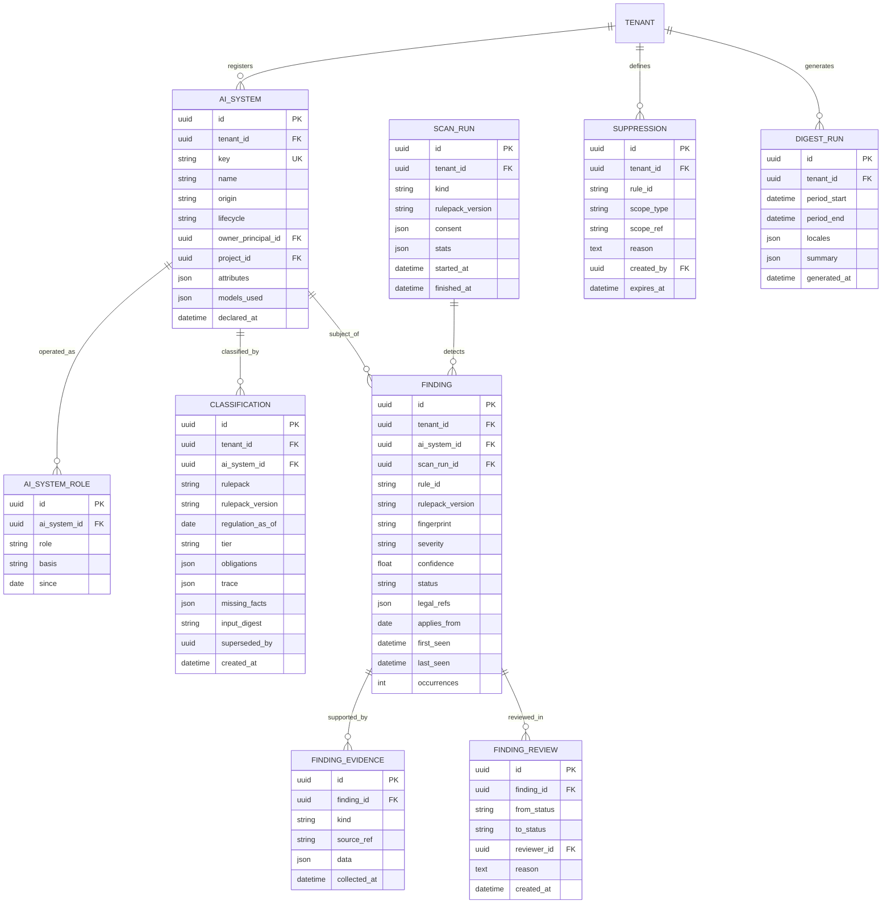

# Data model

Status: **accepted** on 2026-10-02 (Phase 1). Column lists show the fields that matter
for the design; the complete schema is produced with the migrations in Phases 2–4.
Implemented so far: `tenant`, `outbox_event` (Phase 2); `team`, `project`, `principal`,
`role_binding`, `api_key`, `audit_chain_head`, `audit_entry`, `interaction`,
`usage_rollup`, `budget` (Phase 3).

Where the schema built in Phase 3 differs from the diagrams below:

| Diagram | In the schema | Why |
|---|---|---|
| `API_KEY.key_prefix` | `key_id` (public, unique, what the lookup uses), `key_hash`, `pepper_id`, `name` | ADR-0028 |
| `API_KEY.ai_system_id` as a foreign key | A plain column for now | The inventory table arrives in Phase 4, and the foreign key with it |
| `ROLE_BINDING` without a tenant | `tenant_id` added | Every tenant-owned table has one (ADR-0015) |
| `INTERACTION` | `team_id`, `deployment` and `cached_input_tokens` added; unique on `(tenant_id, source, source_record_id)` | Roll-ups per team; the deployment that answered; cached tokens are priced apart (ADR-0030) |
| `INTERACTION.cost_estimate`, `BUDGET.limit_amount` as decimals | Integers scaled by 10^9, `Decimal` in code | Exact sums on SQLite and PostgreSQL (ADR-0030) |
| `USAGE_ROLLUP` keyed by granularity and period start | Keyed by `(tenant_id, scope_type, scope_id, day, currency)`; one row per day | A month is the sum of its days; counters for denied, failed, unpriced and estimated requests added (ADR-0031) |
| `BUDGET.soft_threshold` as a decimal | `soft_threshold_percent`, an integer | No fractional amounts outside money |
| `AUDIT_ENTRY.resource_id` as a UUID | A string | API keys are named by their public key id |
| `PAYLOAD_BLOB` | Not created | The opt-in store of redacted content is deferrable (ADR-0009) |

Conventions (ADR-0015):

- Every tenant-owned table has a non-nullable `tenant_id`, leading its indexes.
- Primary keys are time-ordered UUIDs.
- Timestamps are UTC.
- JSON columns use the generic JSON type and are never queried with dialect operators.
- Rule packs, price catalogues and message catalogues are **files**, not tables; rows
  reference them by id and version.

## 1. Identity and tenancy

- `PRINCIPAL.kind` is `user` or `service`. `external_id` holds the identity provider's
  subject once Entra ID is added. `display_name` is the only personal datum here; erasing
  it leaves a pseudonymous id that other tables keep referencing.
- `ROLE_BINDING.role` is `admin`, `auditor` or `developer` in v0.1, scoped to a tenant,
  team or project.
- `API_KEY.ai_system_id` is what ties a request to an inventory entry. It is nullable:
  traffic from a key with no system is attributed to a discovered system.

## 2. Gateway

- `INTERACTION` is the canonical record of ADR-0019. `source` is `native` for Arbiter's
  gateway or the name of an external source; `(source, source_record_id)` is unique.
  It holds no prompt or completion text.
- `PAYLOAD_BLOB` exists only for systems that opted in (ADR-0018) and is purged on expiry.
- `USAGE_ROLLUP` is keyed by `(tenant_id, scope_type, scope_id, granularity,
  period_start)`. Budgets are checked against it.
- `AUDIT_ENTRY.decision` holds the decision envelope (see [interfaces](interfaces.md)):
  rule ids and versions, matched conditions, legal references, an input digest. No
  content, no names. `(tenant_id, seq)` is unique.
- Provider deployments and routes are configuration in v0.1, so they have no table.

## 3. Compliance

### AI system

- `origin` is `declared` or `discovered`. A discovered system has no declared attributes
  and cannot be classified until someone completes it; its existence is a finding.
- `attributes` holds the facts the classifier needs: intended purpose, sector, Annex III
  area if any, whether it interacts with natural persons, generates synthetic content,
  performs emotion recognition or biometric categorisation, profiles individuals, and so
  on. The set of recognised facts is defined by the rule pack schema, not by columns, so
  a new rule pack can ask new questions without a migration.
- `models_used` records which models the system calls, including whether each is a
  general-purpose model and who provides it.

### AI Act role (ADR-0007, ADR-0022)

`AI_SYSTEM_ROLE.role` is a closed enumeration: `provider`, `deployer`, `importer`,
`distributor`, `authorised_representative`, `product_manufacturer`.

The role is modelled as a one-to-many relation rather than a single column because one
organisation can hold several roles for the same system, for example building a system
and using it in-house (provider and deployer). `basis` records why the role applies.
v0.1 rule packs evaluate the `deployer` role; other roles are stored and reported as not
yet covered.

This refinement of ADR-0007's "explicit field" was approved as
[ADR-0022](../adr/0022-ai-act-roles-one-to-many.md).

### Classification

- Immutable. `superseded_by` links to the newer row.
- `tier` is one of `out_of_scope`, `prohibited`, `high_risk`, `transparency`, `minimal`,
  `undetermined`. A system can be high-risk and also carry transparency obligations; the
  tier is the most severe outcome and `obligations` lists all of them.
- Each obligation entry: legal reference, role it applies to, `applies_from`, message key.
- `trace` is the list of matched rules with their matched conditions.
- `input_digest` is a hash of the facts used, so that an unchanged system is not
  reclassified needlessly and a changed one is detected.

### Finding

- `fingerprint` is a stable hash of rule id, system and the distinguishing part of the
  evidence. A repeated detection updates `last_seen` and `occurrences` instead of
  creating a new row.
- `status`: `open`, `confirmed`, `false_positive`, `mitigated`, `accepted`. Transitions
  are in [flows](flows.md), section 6; history is in `FINDING_REVIEW`.
- `legal_refs` can point to the AI Act or the GDPR: regulation id, article, paragraph.
- `applies_from` lets severity depend on whether the obligation is already applicable.
- `FINDING_EVIDENCE.data` is redacted before storage; `source_ref` points to an
  interaction id, a file path or a configuration key.

### Scan run

`consent` records, for local scans, which categories the user approved and when.

## 4. Retention

| Data | Default | Configurable |
|---|---|---|
| `INTERACTION` | 13 months | Per tenant; floor per risk class |
| `PAYLOAD_BLOB` | Off; 30 days when enabled | Per system |
| `USAGE_ROLLUP` | Kept | Per tenant |
| `AUDIT_ENTRY` | Kept | No (no content, ADR-0017) |
| `FINDING` and children | Kept while the system exists | Per tenant |
| `OUTBOX_EVENT` | 7 days after dispatch | Global |

Defaults are proposals. Legal minimums are verified in Phase 4.
