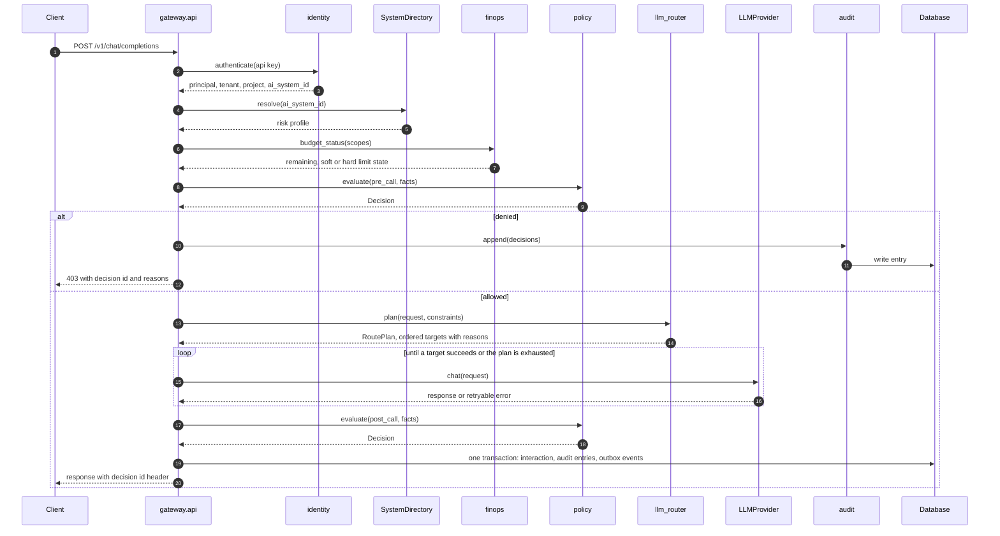
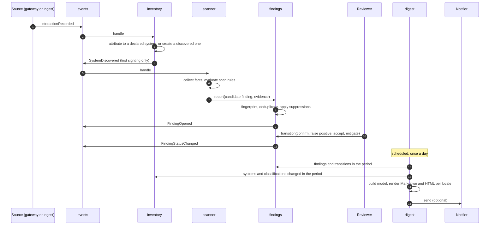
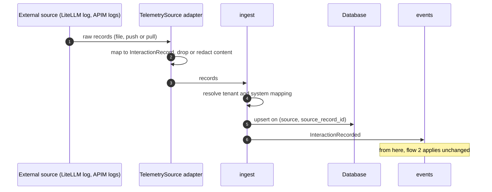
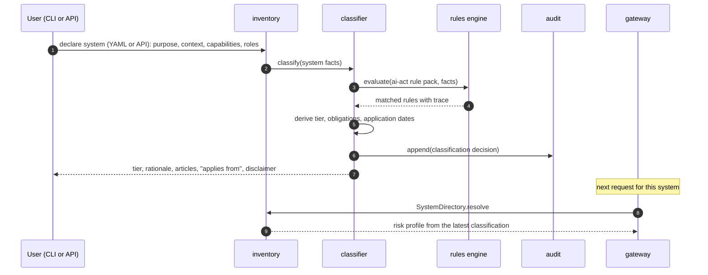
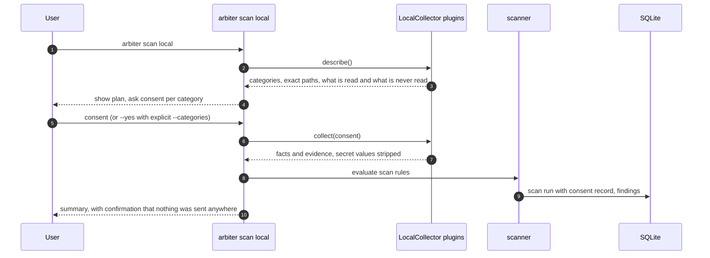
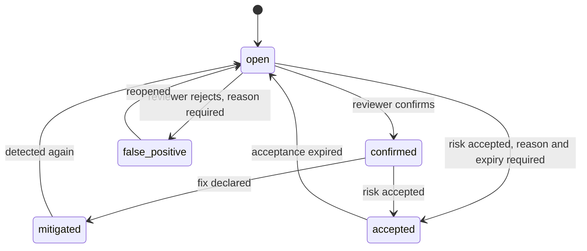

# Flows

Status: **accepted** on 2026-10-02 (Phase 1). Flows are implemented from Phase 3 onwards.

## 1. Chat completion through the gateway

Notes:

- `facts` for the pre-call evaluation: request attributes, the system's risk profile,
  budget state and PII detector results on the prompt.
- Constraints passed to the router come from the policy decision: allowed providers,
  models and regions for the system's risk class.
- The `RoutePlan` lists every candidate with the reason it was kept, excluded or ordered
  as it was; the plan is part of the audited decision.
- Redaction, when a policy requires it, modifies the request before it reaches the
  provider.

## 2. From traffic to digest

Scan rules that work on aggregates (for example "a system with a high-risk profile sent
traffic to a provider outside the EU") run on a schedule over the period rather than per
event.

## 3. Ingestion from an external gateway

## 4. Declaring and classifying a system

A classification is immutable. Changing a declared attribute, or loading a new rule pack
version, produces a new classification that supersedes the previous one; both remain
queryable.

Missing facts do not default silently. If a rule needs a fact that was not declared, the
result lists it under "information needed" and the tier is reported as undetermined for
that branch.

## 5. Local scan with consent

The local agent has no network code path. Sending results to a server is a separate,
explicit command planned for later.

## 6. Finding lifecycle

- Every transition records who, when and why, and is written to the audit log.
- A `false_positive` transition can create a suppression scoped to the finding
  fingerprint, the system or the rule. Suppressions carry a reason and can expire.
- Per rule, the ratio of confirmed to false-positive findings is reported in the digest.
  That is the feedback loop of v0.1: it tells a human which rule to fix.
